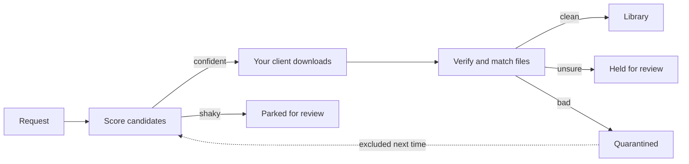

<div align="center">


**Request music. Own everything.**

Self-hosted music requests and discovery with a built-in library and download engine that drives your own clients. No Lidarr. One container.

[](LICENSE)
[](https://github.com/DroppedNeedle/DroppedNeedle)
[](https://hub.docker.com/r/droppedneedle/droppedneedle)
[](https://discord.gg/B5suDg7gu2)
[](https://www.droppedneedle.com/)

[Docs](https://www.droppedneedle.com/) | [Discord](https://discord.gg/B5suDg7gu2) | [Issues](https://github.com/DroppedNeedle/DroppedNeedle/issues) | [Sponsor](https://github.com/sponsors/HabiRabbu)

</div>

---

Search the full MusicBrainz catalogue, request the album or the single track you actually want, and DroppedNeedle takes it from there: it drives your own download client, scores the candidates, verifies every file, and shelves the result in your library. Play it back from Jellyfin, Navidrome, Plex, or local files, or let any Subsonic or Jellyfin app play from you.

> [!NOTE]
> DroppedNeedle only drives a download client you supply and run yourself over its local HTTP API. It never joins a P2P network, ships no indexers, and hosts no audio. What you fetch, and what your client shares back, is your call and your responsibility.

## Contents

- [See it](#see-it)
- [Quick start](#quick-start)
- [What it does](#what-it-does)
- [Download sources](#download-sources)
- [Configuration](#configuration)
- [Troubleshooting](#troubleshooting)
- [For builders](#for-builders)
- [Support and license](#support-and-license)

---

## See it


<details>
<summary>More screenshots</summary>


</details>

---

## Quick start

You need Docker, a music library, and a download client. The example below uses slskd; [SABnzbd](https://sabnzbd.org/) with Newznab indexers or Prowlarr works too. DroppedNeedle runs neither for you. See [slskd](#slskd) and [Usenet](#usenet).

### 1. Save this compose file

Images live on [Docker Hub](https://hub.docker.com/r/droppedneedle/droppedneedle) as `droppedneedle/droppedneedle:latest`.

```yaml
services:
  droppedneedle:
    image: droppedneedle/droppedneedle:latest
    container_name: droppedneedle
    environment:
      - PUID=1000            # run `id` on your host to find your user/group ID
      - PGID=1000
      - UMASK=027            # secure default; 002 for trusted group-writable media
      - PORT=8688
      - TZ=Etc/UTC           # e.g. Europe/London, America/New_York
      - SLSKD_DOWNLOADS_PATH=/data/slskd/complete
    ports:
      - "8688:8688"
    volumes:
      - ./config:/app/config
      - ./cache:/app/cache
      - ./plugins:/app/plugins  # omit and installed plugins vanish on recreate
      # One shared parent mount keeps the library and completed downloads on one
      # boundary so imports move fast. Do not nest extra binds under /data.
      - /path/to/media:/data:rw
    restart: unless-stopped
```

> [!TIP]
> The full annotated compose, including an optional slskd sidecar, is [docker-compose.example.yml](docker-compose.example.yml).

### 2. Start it

```bash
docker compose up -d
```

Then open [http://localhost:8688](http://localhost:8688).

### 3. First run

1. Create the first admin account. This happens once.
2. Add your library path under Settings > Library, using the in-container path (e.g. `/data/music`).
3. Add your download client under Settings > Download Client, then Test and Save.
4. Hit Scan on Settings > Library. The scan reads and identifies files without renaming or retagging anything.
5. Search the catalogue, open an album, and Request it. Watch it land live on the Downloads page.

Settings > Library won't let you remove your last library path while the library still has tracks in it. Set the path to Excluded instead if you want it left alone. If a path disappears from the settings while its tracks are still in the library, the page offers to put it back.

<details>
<summary>Updating and the dev tag</summary>

Update like any other container:

```bash
docker compose pull
docker compose up -d
```

Before a new version changes the database schema, DroppedNeedle writes a verified backup of the database to `/app/cache/backups`. If an upgrade goes wrong, stop the container, delete `library.db-wal` and `library.db-shm` if they exist, put the backup back in place of `/app/cache/library.db`, and run the previous image.

Coming from v2? Follow [docs/upgrading-from-v2.md](docs/upgrading-from-v2.md). v3 does not read a v2 data directory in place. The upgrade tool brings over accounts, settings, linked accounts, follows, playlists, favorites, play history, finished requests and downloads, per-user preferences, and your library as v2 knew it: the same song and album ids (so Subsonic and Jellyfin apps keep their stars and downloads), your manual matches and edition choices, and the originals of files Library Management changed, which "restore original" still brings back. The guide lists exactly what stays behind. Run the import before anyone signs in to v3.

A `:dev` tag (`droppedneedle/droppedneedle:dev`) is built from `main` on every push and may break. Pin a commit with `:dev-<short-sha>`.

</details>

---

## What it does

| Thing | What you get |
|-|-|
| Request | Whole albums or single tracks from the MusicBrainz catalogue, with an approval queue for the User role |
| Wanted | Failed and partial requests get re-searched on their own until a verified copy shows up |
| Quality | Per-format quality floors, automatic upgrades when a better copy appears, storage caps and quotas |
| Player | Queue, shuffle, 10-band EQ, embedded lyrics, live now-playing updates |
| Discovery | Trending, charts, genre browsing, recommendations from your ListenBrainz and Last.fm history, an album-by-album discover queue, and a weekly mix that can queue up to five missing albums |
| Live events | Ticketmaster and Skiddle gig alerts for artists you follow, each user with their own cities |
| Following | New-release radar with optional auto-download, release-type filters, and sidebar badges |
| Library | Browse, filter, download, rescan, and remove albums; unmatched files wait in a manual-review queue. Admins see artists that appear twice under the same name, with the MusicBrainz evidence for each, and can mark them as different people |
| Free Music | Internet Archive items under Creative Commons or public-domain licences, licence shown up front, no account or API key, off with one toggle |
| Drop imports | Drag in a zip or loose files from anywhere you buy music; identified, tagged, and shelved, or held for a manual match |
| Playlists | Mix Jellyfin, Navidrome, Plex, local, YouTube, and Spotify imports in one place, share read-only with one toggle |
| YouTube links | Find an album or its tracks on YouTube from the album page and play them there. Paste your own links on the YouTube library page. Each search spends one unit of the daily quota set under Settings > YouTube; a saved link never searches again |
| Library Management | Optional MusicBrainz Picard-style tags, artwork, and organization behind an admin preview with dry run and typed confirmation. Off until you enable it |

How a request moves:



The engine searches your client, ranks candidates, and auto-accepts a confident match. Close calls park for review instead of guessing.

Downloads follow the edition you chose. If the album is already in your library, a request, an "acquire this edition", or an upgrade fetches the edition you picked by hand, else the one you pinned, else the one that best fits your files. For an album you don't have yet, it fetches the edition the album page showed you. Candidates are ranked against that edition's tracklist: first by how many of its tracks a folder holds, then by how close the track lengths are, then by quality, then by speed.

A single track is fetched the way you would do it by hand. DroppedNeedle looks up which album the track is on (the edition you chose for it if you own that album, else the release you asked from, else the main official album rather than a compilation or a live set), searches for that album, picks the peer sharing the most complete album folder, and downloads only the track you asked for. The file is then checked against that album's tracklist. A peer sharing just the one song is only used when nobody shares the album with it; when that happens the download records why. On Usenet, which can't download single files, the album release is fetched and only your track is imported. Every finished download is checked before it touches the library: the files must be readable audio of the right album and edition, inside your quality range, and match a release of the album you asked for track by track. Files that pass are tagged, named by your naming template and filed in the library. Files that don't fit well enough are held for you to look at, and bad sources get quarantined so they stop winning.

Follow an artist and DroppedNeedle checks MusicBrainz for their new releases once a day, a few artists at a time and behind your own page loads, so it never crowds MusicBrainz. The first check only remembers what the artist already has. After that, anything new that matches your release types (Settings > Release Types) and that you don't already own shows up under Following > New Releases, with a badge in the sidebar. Turn on auto-download for an artist and new releases are downloaded on their release day: one download per release, even when several people follow the artist, and nothing is fetched if it's already in the library or already downloading. Regular users need an admin to approve auto-download first; trusted users and admins don't. If MusicBrainz can't be reached, the artist is tried again an hour later.

| Direction | What plugs in |
|-|-|
| In | Your slskd, your SABnzbd with your Newznab indexers or Prowlarr, Internet Archive free licences, and drop imports. Identity from MusicBrainz and AcoustID, album art from your files and the Cover Art Archive, artist photos from Wikidata and AudioDB |
| Out | Jellyfin, Navidrome, Plex, local files, and YouTube previews, plus OpenSubsonic and Jellyfin APIs so apps like Symfonium, Finamp, Feishin, Amperfy, Jellify, and Manet can play from you |
| Around | ListenBrainz and Last.fm scrobbling, Spotify playlist import, Ticketmaster and Skiddle gigs, Deezer and iTunes preview clips, and purchase links that put Bandcamp first |

---

## Download sources

### slskd

DroppedNeedle talks to your own running slskd over its local HTTP API (`X-API-Key`). You bring slskd; DroppedNeedle drives it.

- Use slskd 0.25.0 or newer (0.25.1 is the verified pin: `slskd/slskd:0.25.1`), with a Soulseek account inside it.
- Give DroppedNeedle the URL plus API key under Settings > Download Client, then Test and Save. The key is stored encrypted and never logged.

> [!IMPORTANT]
> Soulseek bans clients that share nothing, so give slskd at least one shared folder or searches and downloads fail. Everything in a shared folder goes out to the network. Choose it like you mean it.

The downloads path is where most installs go wrong. Three rules:

1. Expose slskd's completed-downloads directory to DroppedNeedle read-write under one shared parent mount (e.g. library at `/data/music`, completions at `/data/slskd/complete`).
2. Point `SLSKD_DOWNLOADS_PATH` at that exact directory, not its parent.
3. Skip nested binds under `/data`. Each one is a new mount boundary, which drops imports to the slower copy fallback.

Keep slskd's incomplete directory on the same mount as its downloads directory: slskd can report a transfer Completed before a cross-mount move between the two finishes, so a split mount risks verifying half-copied files.

<details>
<summary>Minimal slskd.yml essentials</summary>

```yaml
soulseek:
  username: your-soulseek-username
  password: your-soulseek-password

shares:
  directories:
    - /data/share   # required: share something or the network bans you

directories:
  downloads: /downloads   # the sidecar path; bind its host dir into DroppedNeedle too

web:
  authentication:
    api_keys:
      droppedneedle:
        key: choose-a-long-random-key
```

</details>

### Usenet

The second source is Usenet through SABnzbd. For searching, either add Newznab-compatible indexers one by one (NZBGeek, NZBPlanet, NZB.su, Slug, and others) or point at a Prowlarr that already has them. The engine searches your chosen side, enqueues NZBs in your SABnzbd, and imports finished files through the same scoring, verification, and quarantine pipeline as slskd.

1. Expose SABnzbd's completed-downloads directory read-write, ideally under the same shared parent mount as the library so the [mount rules](#slskd) hold. In SABnzbd, point its Downloads folder setting at the matching path (e.g. `/data/sabnzbd/complete`).
2. Under Settings > Download Client, enable Usenet and enter your SABnzbd URL and API key.
3. Under Settings > Indexers / Prowlarr, pick one search backend: add each indexer's URL plus API key, or enter your Prowlarr URL plus API key. Then Test and Save.

slskd and Usenet can run side by side; the source priority control picks who goes first.

---

## Configuration

Everything user-editable lives in the web UI and lands in `config/config.json`. Environment is only for container basics:

| Variable | Default | What it is |
|-|-|-|
| `PUID` | `1000` | File owner inside the container (run `id` on the host) |
| `PGID` | `1000` | File group inside the container |
| `UMASK` | `027` | Creation mask for new files; `002` for trusted group-writable media |
| `PORT` | `8688` | Port the app listens on |
| `BIND_HOST` | `auto` | `auto` listens on IPv4 and IPv6, dropping to IPv4 alone where IPv6 is off. Set `0.0.0.0`, `::`, or one interface IP to pin it |
| `TRUSTED_PROXY_IPS` | `127.0.0.1,::1` | IPs/CIDRs whose `X-Forwarded-*` headers are trusted; point it at your reverse proxy, listing every address family it arrives on. `*` trusts every peer: only behind a proxy that strips spoofed headers |
| `BASE_PATH` | empty | Serve under a sub-path behind a reverse proxy, e.g. `/music`. Letters, digits and `.` `_` `~` `-` only, no trailing slash, and its first segment cannot be `api` |
| `TZ` | `UTC` | Container timezone |
| `SLSKD_DOWNLOADS_PATH` | `/data/downloads/slskd` | Exact in-container path to slskd completions (the compose example uses `/data/slskd/complete`) |
| `LOG_LEVEL` | `INFO` | `DEBUG`, `INFO`, `WARNING` or `ERROR` |

The app answers on IPv4 and IPv6, but Docker still has to publish the port on both. `docker port droppedneedle` should list `0.0.0.0:8688` and `[::]:8688`; if only the first appears, turn on IPv6 for the daemon (`"ipv6"` and `"ip6tables"` in `/etc/docker/daemon.json`). Pinning `BIND_HOST` to one interface IP answers only there, but the container `HEALTHCHECK` still uses localhost, so keep a wildcard or loopback value unless you check that address yourself.

With `BASE_PATH` set, everything moves under it: the web UI, `/api/v3`, the Subsonic and Jellyfin APIs, and `/health` (the container health check follows it). Point your proxy at the prefix without stripping it.

<details>
<summary>Rarely needed variables</summary>

| Variable | Default | What it is |
|-|-|-|
| `CONTACT_EMAIL` | `contact@droppedneedle.com` | Contact address in the outbound User-Agent; MusicBrainz asks for one, so set your own if you run many lookups |
| `SHUTDOWN_GRACE_PERIOD` | `10` | Seconds to finish open requests and stop background work on shutdown |
| `HTTP_TIMEOUT` | `30` | Outbound request timeout, seconds |
| `HTTP_CONNECT_TIMEOUT` | `10` | Outbound connect timeout, seconds |
| `HTTP_MAX_KEEPALIVE` | `50` | Idle outbound connections kept per host |
| `RUST_LOG` | unset | Full log filter (e.g. `info,droppedneedle::library=debug`); wins over `LOG_LEVEL` |
| `ROOT_APP_DIR` | `/app` | Base for the paths below and for `/app/plugins` and `/app/imports` |
| `CACHE_DIR` | `/app/cache` | Database, backups, served web UI, caches |
| `COVER_CACHE_MAX_SIZE_MB` | `500` | Size cap for downloaded and extracted cover art under `CACHE_DIR/covers`; the least recently shown covers go first |
| `LIBRARY_DB_PATH` | `/app/cache/library.db` | The database file; backups go in `backups/` next to it |
| `CONFIG_FILE_PATH` | `/app/config/config.json` | Settings file; the encryption key sits next to it |
| `DROPPEDNEEDLE_STATIC_DIR` | `/app/static` | The web UI build shipped in the image |

</details>

<details>
<summary>Permissions and NAS notes</summary>

Keep `027` for a private box. Use `002` when DroppedNeedle and another trusted service in the same group both write the same media. Skip `000`: it makes new files writable by every local account the filesystem allows. `UMASK` shapes new files only; a move can keep the source mode the download client set.

Unraid commonly uses `nobody:users` (PUID 99, PGID 100). Point PUID and PGID at whoever owns the mounted config and cache paths. The container skips ownership changes it cannot make, which covers FUSE, NFS, CIFS, and rootless setups. A read-only config or cache mount refuses to start before anything gets written.

`/app/config` and `/app/cache` must be writable and honor SQLite locking, `fsync`, and atomic replacement. Plain bind mounts, named volumes, local Unraid shares, and TrueNAS datasets with normal permissions all qualify. NFS and SMB mounts only work when they support the same file locking SQLite needs. On Docker Desktop for Windows, prefer named volumes for those two paths.

</details>

| Data | Container path | Notes |
|-|-|-|
| Settings and encryption key | `/app/config` | Persist it |
| Database, backups, cover art and metadata cache | `/app/cache` | Persist it |
| Plugins | `/app/plugins` | Persist it or installs vanish on recreate |
| Download and drop-import staging | `/app/imports` | Optional; without it, staged downloads, large uploads and unmatched files live on the container layer |
| Media | `/data` | Shared parent for library (`/data/music`) and client completions |

Where things live in the UI:

| Setting | Location |
|-|-|
| Library paths, naming template, scan schedule, AcoustID key | Settings > Library |
| Library Management profiles, previews, recovery | Library Management (admin) |
| Download clients, indexers, quality tiers, verification, wanted watcher | Settings > Download Client |
| Subsonic and Jellyfin APIs, app passwords, transcoding | Settings > Connect Apps |
| Jellyfin | Settings > Jellyfin |
| Navidrome | Settings > Navidrome |
| Plex | Settings > Plex |
| Local files | Settings > Local Files |
| Last.fm app key (admin, once per instance) | Settings > Last.fm |
| YouTube API key | Settings > YouTube |
| Spotify client ID and secret | Settings > Spotify |
| Ticketmaster and Skiddle keys, sweep scope | Settings > Live Events |
| Scrobbling and discovery accounts | Profile > Scrobbling & Discovery |
| Home layout, release types, MusicBrainz source | Settings > Preferences |
| Users, roles, Jellyfin and Plex user import | Settings > Users |
| Password breach checking, HSTS, who can download library files | Settings > Security |
| Discover queue size, freshness and tuning | Settings > Advanced |

Album covers come from your own files first: an image in the album folder (`cover.jpg`, `folder.png`, `front.jpg` and the like) or a picture embedded in a track. The library picks these up after each scan, and large pictures are scaled down for the grid. Albums without local art get their cover from the Cover Art Archive, cached on disk. To prefer the Cover Art Archive over your files, turn off "Prefer local cover art" under Settings > Advanced.

The discover queue on the Discover page deals you albums one at a time. It is built in the background from what you listen to: artists similar to your top artists, your genres, fresh releases, artists you love on ListenBrainz and lesser-played albums by your favourites, with a couple of trending picks mixed in. Last.fm users get similar artists and charts from Last.fm instead, and your Jellyfin most played and favourite artists fill in when ListenBrainz has too little history. Without any of them the queue is trending albums. Albums already in your library are left out. Ignore an album and it stays out of every future queue for a year (the retention is under Settings > Advanced). To hide the queue, switch it off under Settings > Discover. A built queue survives a restart and counts as stale after its freshness window (24 hours by default), after which the page builds a new one.

Your Weekly Mix is a playlist built for each user with a linked ListenBrainz account. It takes your ListenBrainz weekly-jams and weekly-exploration playlists and tops them up to 100 tracks with songs from artists similar to the ones in them. Songs you already own play from your library. The server rebuilds every mix once a day if it is more than six days old, and you can rebuild yours any time with Refresh under Profile > Scrobbling & Discovery. If you switch on "auto-request" there, each build also requests up to five albums from the mix you don't have yet. Admins get this straight away; other users wait for an admin to approve it on the Requests page. An admin can reject or later revoke it, which also switches the toggle off.

Last.fm works like this: the admin registers one Last.fm API application at last.fm/api/account/create, saves its key and shared secret under Settings > Last.fm and switches Last.fm on, once for the whole server. Each user then clicks Connect under Profile > Scrobbling & Discovery, approves DroppedNeedle on last.fm, and clicks Finish. Their scrobbles go to their own Last.fm account. Users can also bring their own API application: if the server has no key saved, Connect asks for the user's own key and secret first, and a user can always store a pair through the API (`PUT /api/v3/me/connections/lastfm`). A user's own pair replaces the server's key for that user only. The Last.fm sections on artist and album pages follow the same rule: they read with the user's own key when one is saved, and with the server's key otherwise. Last.fm charts on the home page need the server's key; "your top albums" from Last.fm read your linked account. If the admin later changes the server's key, everyone who linked with the old one has to click Connect again: Last.fm sessions belong to the key that created them. Link ListenBrainz with the token from your ListenBrainz profile. Artist pages show photos from Wikidata and AudioDB (AudioDB is on by default, free key rate limits apply), with proxying and TTLs under Settings > Advanced. Other artist thumbnails show a placeholder for now.

Music apps (Subsonic and Jellyfin) sign in with an app password from Settings > Connect Apps. A track is only transcoded when the app asks for another format or a lower bitrate. If the app names no bitrate, Opus streams at 128 kbps and MP3 at 192 kbps, never above the max bitrate you set. Each user can run two transcodes at once, so gapless players can load the next track early. Finamp's transcoded playback uses HLS, which needs transcoding on and ffmpeg installed. Only sign-in attempts are rate limited per IP address, and a run of wrong passwords locks that address out for a short while.

Spotify playlist import needs an app from the Spotify developer dashboard. Add the redirect URI that Settings > Spotify shows (it ends in `/api/v3/acquire/spotify/auth/callback`) to the app, then save the app's client ID and secret there. Each user then clicks Connect on the Spotify card in their profile, and Disconnect there unlinks it again. If you set up Spotify on v2 and imported your settings, nothing changes in the dashboard: DroppedNeedle keeps using the old address the app already lists, and Settings > Spotify shows that one. Saving a different client ID switches to the new address.

You can download a single track or a whole album from the library. A track comes as the original file. An album comes as a zip of its files, untouched and uncompressed, and starts downloading straight away, so even a big box set doesn't keep you waiting while the server packs it. Only files the library has scanned, sitting inside one of your library folders, can be downloaded. By default every signed-in user can download; to keep it to trusted users and admins, or admins only, change "Library downloads" under Settings > Security. Streaming is never limited by this setting.

### Users and roles

| Role | Requests | Admin |
|-|-|-|
| Admin | Requests start immediately, no approval | Everything: users, approvals, all settings |
| Trusted | Requests start immediately, no approval | Nothing admin side |
| User | Requests wait for admin approval | Nothing admin side |

The first account is always admin. Later accounts are created by an admin or automatically on first Jellyfin, Plex, or OIDC sign-in (all start as User). Every login method toggles in the UI; no environment variables involved. Sessions last 30 days and die with the account if an admin deletes it.

<details>
<summary>Setting up OIDC</summary>

Any OpenID Connect provider works (Authelia, Keycloak, Authentik, Pocket ID, and others):

1. In your provider, create a client for DroppedNeedle. Set its redirect URI to `https://your-droppedneedle-url/api/v3/auth/oidc/callback`. If you serve DroppedNeedle under a sub-path with `BASE_PATH`, put that in front: `https://example.com/music/api/v3/auth/oidc/callback`.
2. Under Settings > Security, enter the issuer URL, the client ID, the client secret (leave it empty for a public client), and the same redirect URI. Keep `openid` in the scopes; `openid email profile` is the default.
3. Test, switch it on and save. A single sign-on button appears on the login page.

Things worth knowing:

- Use https for the provider. Plain http only works when the provider runs on the same machine or on your local network (a 10.x, 172.16-31.x, 192.168.x, 100.64-127.x or IPv6 local address, or `localhost`), and that applies to every address in its discovery document too. A v2 setup that used plain http to a public address stops working until you switch the provider to https; the server log and the Test button say so. DroppedNeedle also does not follow redirects from the provider, so enter its final URL.
- The issuer URL is the one your provider lists as `issuer` at `/.well-known/openid-configuration`. DroppedNeedle checks that the two match and refuses to log in if they don't.
- DroppedNeedle checks the signature, audience, expiry and nonce of every login token against the keys your provider publishes, so the server needs to reach your provider directly, not only your browser.
- A sign-in only joins an existing DroppedNeedle account when the provider says the email address is verified. Otherwise it creates a new account.
- The first account on a fresh install becomes the admin, whichever way it signs in.
- Coming from v2? The old callback, `/api/v1/auth/oidc/callback`, still works, so the provider needs no change after the upgrade.

</details>

<details>
<summary>Signing in with Plex or Jellyfin</summary>

Turn on "Allow login with Plex" or "Allow login with Jellyfin" on that server's settings page. The login page then shows the matching tab, and the sign-in only works while the switch is on.

- Jellyfin checks the username and password against your Jellyfin server.
- Plex sends the user to plex.tv to approve the sign-in. When a Plex server is set up, only accounts that can reach that server get in, and if DroppedNeedle cannot reach the server to check, nobody gets in until it can.
- The check uses the Plex URL on the Plex settings page even while the Plex integration itself is switched off. Clear the URL if you want Plex login without the server check.
- Careful: with "Allow login with Plex" on and no Plex server set up, anyone with a plex.tv account can create an account on your DroppedNeedle. Set up the server first, or keep the switch off.

Either way the user's own media account is linked for playback, so plays count for them without extra setup. Admins can also pre-create accounts for everyone on the media server from Settings > Users > Import; those people then sign in with Plex or Jellyfin and land in their account.

</details>

<details>
<summary>Adding a missing album to MusicBrainz</summary>

When an album in your library isn't on MusicBrainz yet, an admin or trusted user can add it from the album page with "Contribute to MusicBrainz". DroppedNeedle never edits MusicBrainz for you; it fills in the MusicBrainz release editor and you check and submit it there, under your own MusicBrainz account.

1. Start the contribution. The draft is built from your files: title, artist, tracklist and lengths. Fix anything that's wrong; every value you change is marked as entered by you.
2. Optionally pick the matching Discogs release. Its label, catalogue number, barcode and country can fill the draft, and the Discogs link goes along as a source. Discogs data is only shown for six hours, then you select the release again to refresh it.
3. Run the duplicate check. If MusicBrainz already has the release, link to it instead and you're done. If it only has similar releases, confirm they are different editions.
4. Open the MusicBrainz editor, review and save the release there. MusicBrainz sends you back to DroppedNeedle, which checks the new release in the background (new releases can take a few minutes to show up) and then links the album to it.

If the check can't link the album, the contribution says why and what to do next, and you can retry or enter the release link by hand. If your files change while a contribution is open, rebuild it from the album's current files.

MusicBrainz sends you back to the address your browser used to reach DroppedNeedle, so this works behind a reverse proxy and under `BASE_PATH` without extra setup.

</details>

---

## Troubleshooting

- Downloads finish in the client but never import: `SLSKD_DOWNLOADS_PATH` must point at the exact completions directory, visible read-write. The Download Client page shows the path status and the reason. Every few minutes DroppedNeedle also checks whether slskd's finished downloads can actually be found in that folder, and if they can't, the page says why: the folder looks empty, or it holds other files (usually because the mount is a parent folder such as your whole media share). It also shows where slskd itself saves, so you can line the two up. A wrong path is usually fixed with the downloads subfolder box on that page.
- Separate-mount warning: imports still work through copy-and-remove, which briefly needs room for both copies. One shared `/data` parent with no nested binds restores fast moves.
- Client connection fails or returns 401: wrong URL or API key. Re-enter both under Settings > Download Client and Test.
- Searches return nothing or the network drops you: slskd needs shared folders and a healthy Soulseek connection. Leechers get banned.
- Scan finds nothing or files pile into manual review: check the library path is readable. Untagged files with no fingerprint match need a human.
- Now playing, scan progress and "download started" pop-ups only change when you reload: each open tab keeps one long-lived connection to `/api/v3/events/stream` for live updates, and something in between is holding it back. Behind nginx, add `proxy_buffering off;` and `proxy_read_timeout 1h;` for that path (the app already sends `X-Accel-Buffering: no`). Other proxies have a similar "don't buffer" switch. Don't let the proxy compress `text/event-stream` either.

<details>
<summary>More fixes</summary>

- How an album gets identified: when most of its files carry a MusicBrainz release ID (Picard and beets write one), DroppedNeedle looks that release up and checks every track against it. Otherwise it searches by album and artist, fetches the tracklists of the best few releases, and pairs each file with a track by title, track number and length. A close match is identified on its own. A plausible but loose match, or two different albums that fit about equally well, goes to the review queue with each candidate's distance (0 is a perfect fit) and what it is made of. Live albums, and compilations your tags don't call compilations, are only matched to their release group until you pick the edition.
- Wrong match, or want a different edition? Open the album and choose Re-identify (admins only). DroppedNeedle checks the album against MusicBrainz again and lists every candidate with its evidence, but changes nothing until you pick one. You can also search MusicBrainz yourself, list every edition of the album's release group with "Show every edition of this album", or paste any release link, and check that exact release. When you pick, you choose how it sticks: the exact release (every file has to fit one of its tracks), a custom edition that keeps your files as they are under that album, or leave the album out of file organizing. A candidate the matcher would have accepted on its own goes through in one click; anything else asks you to confirm. The check runs in the background, waits while a scan is running, retries a few times if MusicBrainz is down, and can be paused, resumed or stopped. Your pick sticks: later scans, retags and moves never replace it with an automatic match. If a check or a pick can't go through, you get a short reason and what to do next.
- An edition picked automatically can be undone by an admin. The album and its tracks go back to exactly what they were before, or the album goes into the review queue if it had no match yet. Tracks you matched by hand are left alone. Once anything else changes the album, the undo is no longer offered.
- Fingerprinting stays off until you add an AcoustID API key. With a key, only albums whose tags don't match well get fingerprinted, twenty files per AcoustID request.
- A retag under Library Management writes the full set of MusicBrainz tags from the release the album was identified as, with the tag names Picard uses, so other players and taggers recognise the files. WAV and AAC files are read-only and keep their tags.
- Scans live on the Scanning tab of Library Management. A running scan can be paused, resumed or stopped there; stopping keeps everything it already read. Rescan files rereads every file in the folders you pick, even ones that look unchanged, which helps after you fix files with another tool. Each finished run in Recent runs lists the files it could not read or skipped, each with a short reason and what to do about it (for example, a damaged file says to re-download or replace it). If someone changed the library folders since you opened the page, the scan is refused: reload and try again.
- Identification has its own Pause button on the same tab. The album being identified finishes, nothing new starts until you press Resume, and new scans keep queueing albums in the meantime.
- MusicBrainz lookups pace at 1 request per second on the official MusicBrainz server. Built-in BrainzMash runs its own local pacing instead. Either way, later scans are incremental, so the first one is the slow one.
- What happens when a download finishes: DroppedNeedle reads every file, then checks them. Wrong album or edition (a live album or box set when you asked for the studio album), files outside your quality range, sample clips or unreadable files mean that source is skipped and the next one is tried. The rest are matched against the release you asked for, the same way album identification works. If the album is already in your library, the edition chosen for it (the one you picked by hand, else the one you pinned, else the one that best fits your files) is the only one accepted: the files are checked against its tracklist, files tagged as another edition send DroppedNeedle to the next source, and the missing tracks it asks for come from that edition. A close match goes into your first library folder under your naming template, with the full MusicBrainz tags written, and shows up in the library and on the request straight away, without waiting for a scan. Tracks you already have are not imported twice, and extra files the release doesn't list (bonus tracks, scene extras) are left out. If some files clearly name other songs, sound like a different recording, or the album as a whole is not close enough, those files are copied to the held area for you to look at, that source is skipped, and the next one is tried, asking only for the tracks still missing. The download settles as held or partly imported only once there are no sources left, or straight away when the only thing in the way is on your side (a file already sitting where a track would go), since another source would not help. When a download is an upgrade for an album you already have, the new files are held as an upgrade waiting for you rather than replacing what you own. A download with thousands of files is not treated as one album: nothing is imported or copied, and the files stay where they are for you to sort out. Each skip and hold is recorded with a short reason and what you can do about it.
- Retry import on a failed download imports the files it left on disk right away, with the same checks, without searching or downloading again.
- The Downloads page updates on its own: progress, new tasks and status changes arrive over the same live connection as the rest of the app, so nothing needs a reload. Every download that failed, was held or landed short shows one short reason and what you can do about it, taken from what the import decided (for example "The files belong to a different album by the same artist"), never a raw error.
- On the Downloads page you can cancel a download, retry it, or move a Soulseek download that sits in a slow peer's queue on to the next source. Cancel on a failed download stops its automatic retries and its wanted watch. Retry starts a fresh attempt straight away; for an album it also clears that album's blocked sources, so a source that failed before gets another chance. The bulk buttons clear finished downloads, stop every scheduled retry, or retry every failure that won't retry by itself. Admins see and act on everyone's downloads; everyone else sees their own.
- Admins can see blocked sources (Downloads > Quarantine) with the reason each was blocked, and remove one so it can be tried again. Blocks expire on their own after a week.
- Moving, renaming or retagging music files yourself is fine. The next scan sees a moved file as the same track and a moved or retagged album as the same album, so favorites, play history, playlists and album matches stay put. Two copies of an album in different folders (say a FLAC and an MP3 copy) stay two albums.

</details>

---

## For builders

The OpenAPI document is served at `/openapi.json` on your instance. Every `/api/v3/*` route takes a Bearer token or the session cookie, everything under `/api/v3/settings/*` also needs Admin, and `/health` stays public for the container check.

Plugins work like community plugins in Lidarr: paste a GitHub repository URL in Settings > Plugins, check what it asks to do, and install it, pinned to an exact commit. Each enabled plugin runs as its own process, so a crash or a hang stays with that plugin; it gets a clean environment, its own folder and a memory cap. It is still trusted code with your server's file and network access, not a sandbox, so only install plugins you trust. Python plugins work out of the box in the Docker image, and v2 plugins port with an import change. Nothing is bundled. Reference: [PLUGINS.md](PLUGINS.md). Walkthrough: [docs/PLUGIN-CREATION.md](docs/PLUGIN-CREATION.md).

Bug reports and feature requests go to [Issues](https://github.com/DroppedNeedle/DroppedNeedle/issues), code via PRs. Dev setup, tests, and style rules are in [CONTRIBUTING.md](CONTRIBUTING.md).

---

## Support and license

Docs: [droppedneedle.com](https://www.droppedneedle.com/). Chat: [Discord](https://discord.gg/B5suDg7gu2). Bugs and ideas: [GitHub Issues](https://github.com/DroppedNeedle/DroppedNeedle/issues).

<div align="center">

[](https://ko-fi.com/M4M41URGJO)
[](https://github.com/sponsors/HabiRabbu)

If DroppedNeedle earns its keep, fuel it. Monthly or one-off, both welcome.

</div>

DroppedNeedle is [AGPL-3.0](LICENSE). Copyright (c) 2025 DroppedNeedle and contributors. For commercial licensing, write to contact@droppedneedle.com.
